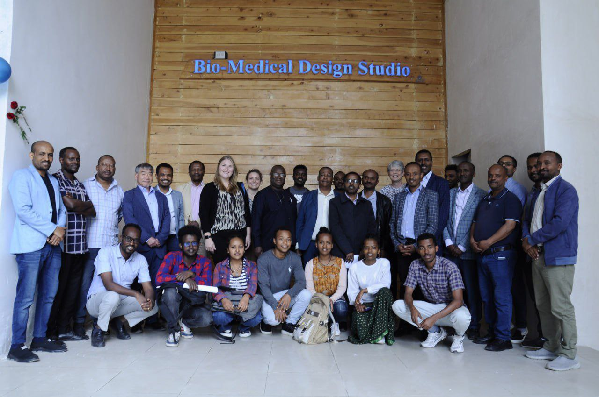

<h1 align="center">Hi 👋, I am Estifanos Aschalew</h1>

  

<h3 align="center">Aspiring Data Scientist | Control Engineer with a Passion for AI & Robotics | Lifelong Learner</h3>

  

  Highly motivated Electrical Engineer with a strong foundation in Electrical and Computer Engineering. Possessing a keen analytical mind and proven collaborative skills, I am seeking to advance my expertise in Artificial Intelligence. With a deep interest in:

<ul>
  <li>Computer Vision</li>
  <li>Data Science</li>
  <li>Image Processing</li>
  <li>Machine Learning</li>
  <li>Deep Learning</li>
  <li>Reinforcement Learning</li>
  <li>Transfer Learning</li>
  <li>Robotics</li>
  <li>IoT</li>
</ul>

  I am eager to contribute to cutting-edge research and development in these domains.

Let's connect and explore exciting opportunities together!

<h3 align="left">Connect with me:</h3>

  
  
  

